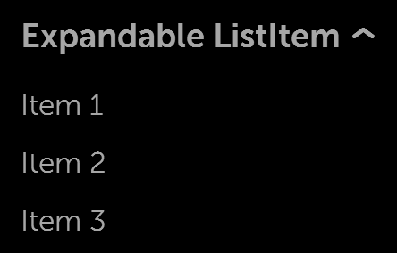
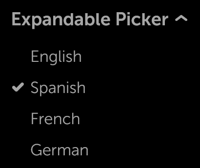
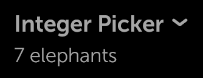
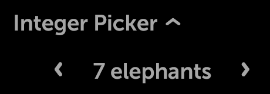
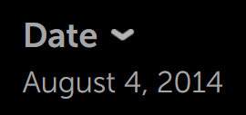
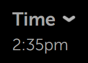
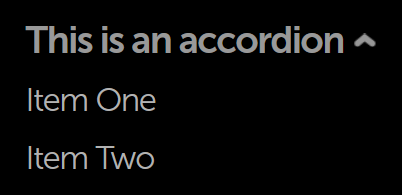
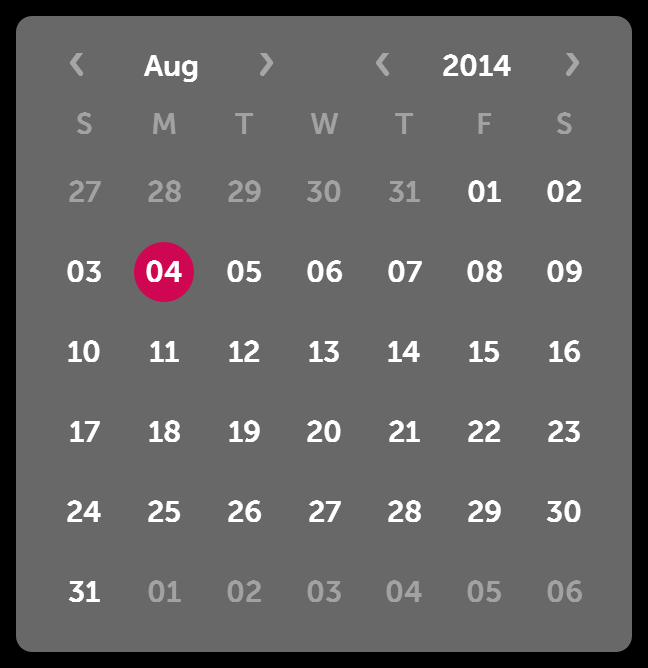

% Pickers

## moon.SimplePicker

[moon.SimplePicker](../../api.html#moon.SimplePicker) is a basic picker that
allows the user to select items from a list.

In 5-way mode, the arrows are focusable and change the selection when pressed.
(Selection state is remembered.)

In pointer mode, the user points at arrows and clicks to change the selection.

This control may be used to select from a short list of options.  Since only one
item is visible at a time, it is recommended that the simple picker be used in
situations where the options are limited and easily understood.  For example, it
is appropriate to use this picker to make a selection from a list of time zones
or from a short list of languages; it is not appropriate to use SimplePicker
with long, data-driven lists.

## moon.SimpleIntegerPicker

[moon.SimpleIntegerPicker](../../api.html#moon.SimpleIntegerPicker) is a control
that prompts the user to make a selection from a range of integer-based options.

The picker may be changed programmatically by calling _previous()_ or _next()_,
or by modifying the published property _value_.

Visually, SimpleIntegerPicker is similar to SimplePicker, with the currently
selected value flanked by navigation arrows on each side.

        {
            kind: "moon.SimpleIntegerPicker",
            name: "picker1",
            value: 3,
            min: 1,
            max: 10,
            step: 1,
            unit: "sec",
            onChange: "changed"
        }

## moon.IntegerPicker

[moon.IntegerPicker](../../api.html#moon.IntegerPicker) is a control used to
display a list of integers and solicit a choice from the user.  The integers
range from `min` to `max`.

To initialize the IntegerPicker to a particular value, set the `value` property
to the integer that should be selected, as in this example:

        {
            kind: "moon.IntegerPicker",
            value: 2013,
            min: 1900,
            max: 2100,
            onChange: "changed"
        }

The picker may be changed programmatically by modifying the published properties
`value`, `min`, or `max`; this is done in the usual way, by calling `set()`
while passing in the name of the property and the desired new value.

## moon.ExpandableListItem

[moon.ExpandableListItem](../../api.html#moon.ExpandableListItem) is a control
with an expanded state and a collapsed state.  As the kind name suggests,
ExpandableListItem is suitable for use within lists; it is also important with
respect to pickers, because a variety of Moonstone picker kinds are derived from
it.

A `moon.ExpandableListItem` control displays a header while also allowing
additional content to be stored in an [enyo.Drawer](../../api.html#enyo.Drawer);
when the header is selected, the drawer opens below.  The drawer is closed by
tapping on the header text or navigating (via 5-way) back to the top of the
drawer.

The control's child components may be of any kind; by default, they are
instances of [moon.Item](../../api.html#moon.Item).

        components: [
            {kind: "moon.ExpandableListItem", content: "This is an expandable list item", components: [
                {content: "Item One"},
                {content: "Item Two"},
                {content: "Item Three"}
            ]}
        ]

  

## moon.ExpandablePicker

One important subkind of `moon.ExpandableListItem` is
[moon.ExpandablePicker](../../api.html#moon.ExpandablePicker), a drop-down
picker menu that solicits a choice from the user.  The picker's child
components, instances of [moon.LabeledCheckbox](../../api.html#moon.LabeledCheckbox)
by default, provide the options for the picker.

        components: [
            {kind: "moon.ExpandablePicker", noneText: "Nothing selected",
                content: "Expandable Picker", components: [
                    {content: "English"},
                    {content: "Spanish", active: true},
                    {content: "French"},
                    {content: "German"},
                    {content: "Italian"}
                ]
            }
        ]

The currently selected item is available in the picker's `selected` property
and may be accessed in the normal manner, by calling `get("selected")` and
`set("selected", <value>)`.  Similarly, the index of the current selection is
available in `selectedIndex`.

The current selection appears beneath the label when the control is closed.

  

  

Like `moon.ExpandableListItem`, `moon.ExpandablePicker` may also be used inline
within lists.

## moon.ExpandableIntegerPicker

Another kind derived from `moon.ExpandableListItem` is 
[moon.ExpandableIntegerPicker](../../api.html#moon.ExpandableIntegerPicker), a
drop-down picker menu that prompts the user to make a selection from a range of
integer-based options.

The value of the currently selected item is available in the picker's `value`
property, while the content of the item is available in `content`.

        {
            kind: "moon.ExpandableIntegerPicker",
            noneText: "Not Selected",
            autoCollapse: true,
            content: "Integer Picker",
            value: 7,
            min: 3,
            max: 15,
            step: 1,
            unit: "elephants"
        }

  

  

## moon.DatePicker

[moon.DatePicker](../../api.html#moon.DatePicker), yet another subkind of
`moon.ExpandableListItem`, contains fields that allow the user to choose a day,
month, and year.

An `onChange` event is fired whenever the user selects a new value for one of
the fields.  This event contains a standard JavaScript Date object representing
the current date.

        {
            kind: "moon.DatePicker",
            name: "picker",
            noneText: $L("Pick a Date"),
            content: "Date",
            onChange: "changed",
            yearText: $L("year"),
            monthText: $L("month"),
            dayText: $L("day")
        }

## moon.TimePicker

The [moon.TimePicker](../../api.html#moon.TimePicker) control has fields that
allow the user to choose an hour value, minute value, and (optional) AM/PM
value.

Like `moon.DatePicker`, `moon.TimePicker` extends `moon.ExpandableListItem`, so
it has an expanded form and a collapsed form.  The expanded form is displayed
when the picker has focus.

An `onChange` event is fired whenever the user selects a new value for one of
the fields.  This event contains a standard JavaScript Date object representing
the current date.

        {
            kind: "moon.TimePicker",
            name: "picker",
            content: "Time",
            meridiemEnable: true,
            onChange: "changed",
            hourText: $L("hour"),
            minuteText: $L("minute"),
            meridiemText: $L("meridiem")
        }

## moon.Accordion

An additional subkind of `moon.ExpandableListItem`,
[moon.Accordion](../../api.html#moon.Accordion) features an arrow to the right
of the header and additional margin space to the left of the drawer containing
the item list.  The arrow points up when the control is expanded, and down when
it is collapsed (the default state).

        {kind: "moon.Accordion", content: "This is an accordion", components: [
            {content: "Item One"},
            {content: "Item Two"}
        ]}

The drawer's state may be toggled by tapping on the header text or navigating
(via 5-way) back to the top of the drawer.

Multiple accordions may be used together in a group; when this happens, only one
accordion in the group may be expanded at any given time.

## moon.Calendar

Though not descended from `moon.ExpandableListItem`,
[moon.Calendar](../../api.html#moon.Calendar) does implement picker
functionality in the form of a monthly calendar, from which the user may select
a particular day.

Each Calendar instance features the month name at the top and a grid of days,
grouped into rows (one per week), below.  The header buttons are used to
navigate to the desired month; the desired day is selected by tapping on it.

        {kind: 'moon.Calendar', name: 'calendar', onChange: 'changed'}

## moon.CalendarDate

[moon.CalendarDate](../../api.html#moon.CalendarDate) is a control that
represents a single day; in a `moon.Calendar` control, each day of the month is
a separate CalendarDate instance.
