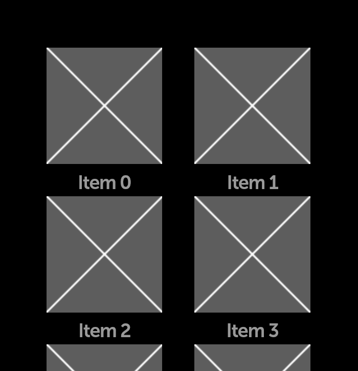

% Grid Lists

## enyo.GridList

[enyo.GridList](../../api.html#enyo.GridList) extends
[enyo.List](../../api.html#enyo.List) to provide a grid for displaying multiple
items per row, based on the available container width.  Because grid lists are
commonly used to display images, we sometimes refer to them as "image grids".

Three rendering modes are supported: `fixedSize`, `fluidWidth`, and
`variableSize` (with or without normalization of rows):

* In `fixedSize` mode, all items have the same size, which may be configured at
    creation time by setting the `itemWidth` and `itemHeight` properties.

* In `fluidWidth` mode, all items have the same size, but may stretch or shrink
    to fit in the available container width, while honoring the `itemMinWidth`
    property. 

* In `normalizeRows` mode, `itemWidth` and `itemHeight` are not known at
    creation time.  The `sizeupItem` event may be used to set the dimensions of
    each item at runtime. 

Here's an example of how a GridList may be used:

        enyo.kind( { 
            name: "App",
            components: [
                { name: "gridList", kind: "enyo.GridList", onSizeupItem: "sizeupItem",
                    onSetupItem: "setupItem", itemMinWidth: 160, itemSpacing: 2,
                    components: [ {name: "img", kind: "enyo.Image"} ] },
            ],
            ... 
            //array of all item data 
            _data: [],      //example: [{width: 100, height: 100, source: "http://www.flickr.com/myimage.jpg"},....]
            sizeupItem: function(inSender, inEvent) {
                var item = this._data[inEvent.index];
                inSender.setItemWidth(item.width);
                inSender.setItemHeight(item.height);
            },
            setupItem: function(inSender, inEvent) {
                var item = this._data[inEvent.index];
                this.$.img.setSrc(item.source);
                this.$.img.addStyles("width:100%; height: auto;");
            }
            ...
        });
 
## moon.GridList

[moon.GridList](../../api.html#moon.GridList) extends `enyo.GridList`, adding
Moonstone-specific configuration, styling, decorators and Spotlight/focus-state
management.

        enyo.kind({
            name: "moon.sample.GridListSample",
            classes: "moon enyo-unselectable enyo-fit",
            components: [
                {
                    name: "gridlist",
                    kind: "moon.GridList",
                    classes: "enyo-fill",
                    onSetupItem: "setupItem",
                    toggleSelected: true,
                    itemWidth: 200,
                    itemHeight: 200,
                    itemSpacing: 50,
                    components: [
                        {name: "item", kind: "moon.GridListImageItem"}
                    ]
                }
            ],
            create: function() {
                this.inherited(arguments);
                this.$.gridlist.show(50);
            },
            setupItem: function(inSender, inEvent) {
                var i = inEvent.index;
                this.$.item.setSource("./assets/default-music.png");
                this.$.item.setCaption("Item " + i);
                this.$.item.setSubCaption("Sub Caption");
                this.$.item.setSelected(this.$.gridlist.isSelected(i));
            }
        });

## enyo.GridListImageItem

[enyo.GridListImageItem](../../api.html#enyo.GridListImageItem) is a convenience
component that may be used inside an `enyo.GridList` to display an image grid.

## moon.GridListImageItem

[moon.GridListImageItem](../../api.html#moon.GridListImageItem) extends
`enyo.GridListImageItem`, adding Moonstone-specific configuration, styling,
decorators and Spotlight/focus-state management.

Add instances of `moon.GridListImageItem` as components of a `moon.GridList`
to create an image grid.
